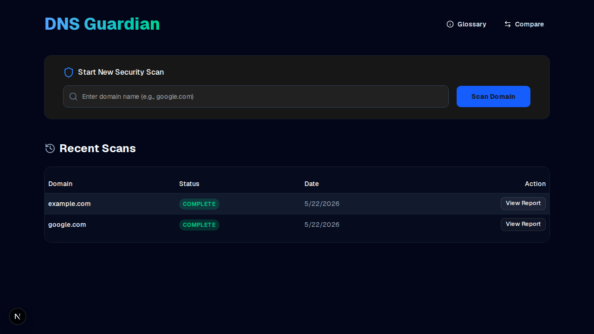
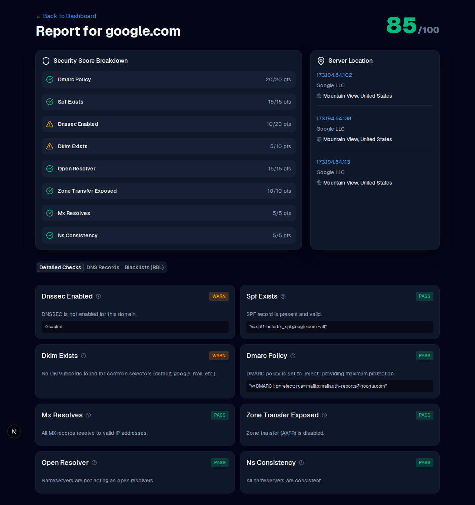
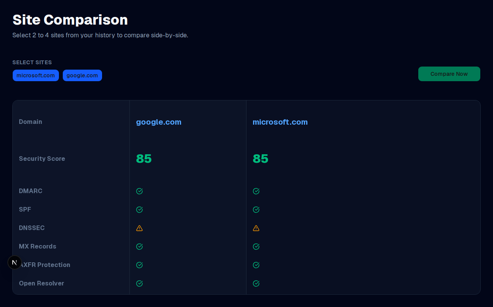
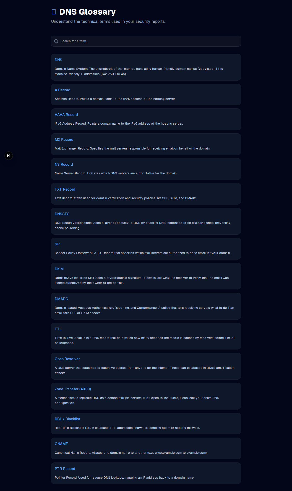

# DNS Guardian

DNS Guardian is a comprehensive DNS security protection and analysis platform. It allows users to audit domain security configurations, monitor blacklists, and compare security postures across different sites.

## Features

- **Authentication System**: Secure JWT-based login and signup.
- **Deep Security Audit**: Automated checks for DNSSEC, SPF, DKIM, DMARC, Zone Transfer (AXFR) exposure, and Open Resolvers.
- **Dynamic Scoring**: A 100-point weighted security metric with detailed pass/warn/fail breakdowns.
- **Site Comparison**: Compare 2-4 sites side-by-side to evaluate their security scores and configurations.
- **Real-time Domain Data**: Live WHOIS data (Registrar, Expiry) and DNS record lookups.
- **RBL Blacklist Monitoring**: Background checks against major Real-time Blackhole Lists.
- **Technical Glossary**: A built-in searchable repository explaining complex DNS and security terms.
- **Modern UI**: A "3D" glassmorphism aesthetic built with Next.js, Tailwind CSS, and Framer Motion.

## Screenshots

### Dashboard & Scan Initiation


### Detailed Security Report


### Site Comparison Tool


### Technical Glossary


## Tech Stack

- **Frontend**: Next.js 14 (App Router), Tailwind CSS, shadcn/ui, Framer Motion, Lucide React.
- **Backend**: FastAPI, SQLModel (SQLAlchemy), SQLite, Pydantic.
- **Security Engine**: `dnspython`, `python-whois`, `bcrypt`, `PyJWT`.

## Getting Started

### Backend Setup
1. Navigate to the `backend` directory.
2. Install dependencies:
   ```bash
   pip install -r requirements.txt
   ```
3. Start the server:
   ```bash
   uvicorn main:app --reload
   ```

### Frontend Setup
1. Navigate to the `frontend` directory.
2. Install dependencies:
   ```bash
   npm install
   ```
3. Start the development server:
   ```bash
   npm run dev
   ```

## Usage
1. Sign up for an account.
2. Enter a domain name in the dashboard to start a security scan.
3. View the detailed report for score breakdowns and RBL status.
4. Use the "Compare" page to select multiple historical scans for a side-by-side view.
